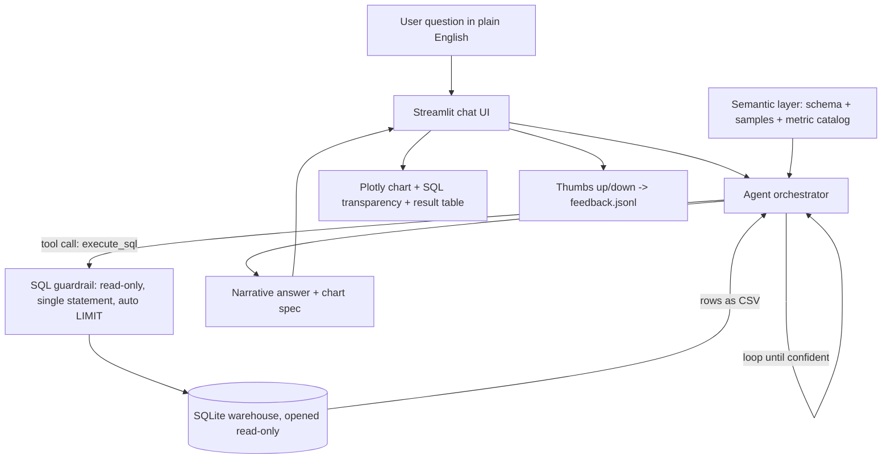

# InsightAgent: Talk to Your Data 📊

**A production-style agentic BI assistant.** Ask a business question in plain English; the agent writes its own SQL, queries a multi-table warehouse, and returns a narrative answer, a chart, and the exact queries it ran. No SQL knowledge required from the user.

> Built as a public, shareable distillation of an internal agentic BI assistant I shipped at Amazon Prime Video, where Senior Product Leaders and Directors query 100+ tables and 120+ metrics in natural language. This repo recreates the core pattern on a synthetic subscription-payments dataset so the approach can be inspected end to end.

**Live demo:** https://insightagent-dvr.streamlit.app/
**Author:** Deepak Vishal Rajan ([LinkedIn](https://www.linkedin.com/in/deepak-vishal-rajan/))

---

## The problem

In most data teams, every "quick question" from a product or finance leader becomes a ticket: someone finds the right tables, remembers how a metric is defined, writes a join, sanity-checks the result, and writes it up. That round trip can take 30 minutes to several hours, and it does not scale with the number of stakeholders.

InsightAgent collapses that loop. A non-technical user asks a question, and an LLM agent grounded in the schema and an agreed metric catalog does the analysis, shows its work, and explains the result in business terms.

## What it does

- Answers natural-language questions over a 5-table warehouse (customers, subscriptions, payments, engagement, plans).
- Runs an **agentic loop**, not one-shot text-to-SQL: the model can issue several queries, read the results, and refine before answering.
- Returns a **decision-oriented narrative**, a **Plotly chart** the agent chooses, the **exact SQL** it executed (for trust), and the **underlying rows**.
- Is grounded in a **metric catalog** (a lightweight semantic layer) so metric definitions stay consistent across answers.
- Enforces **read-only safety** at two independent layers (SQL guardrail plus a read-only DB connection).
- Logs **thumbs up/down feedback** to a JSONL file as a simple closed-loop signal.

## Example interaction

> **Q: What is driving involuntary churn?**
>
> Involuntary churn (subscriptions lost to failed billing) runs at 2.6% overall, but it is highly concentrated by payment method. Gift Card customers churn involuntarily at 12.3% and Debit Card at 4.7%, versus only 1.1% on Credit Card and 0.3% on PayPal, roughly an 11x gap between the worst and best methods. Notably, involuntary churners stream 18.3 hours per month on average, almost identical to active customers at 19.1 hours, and far above the 12.0 hours of voluntary churners. The business is losing engaged, satisfied customers purely to payment plumbing, which makes improved dunning and retry logic the highest-leverage fix.

The agent reaches this by joining `subscriptions`, `customers`, and `engagement`, then framing the result. The SQL is shown in the UI under an expander.

## Architecture



| Component | File | Responsibility |
|---|---|---|
| Semantic layer | `app/semantic_layer.py`, `app/metrics.yaml` | Assembles the grounding context: live schema, sample rows, and the curated metric catalog (the "knowledge base"). |
| Agent | `app/agent.py` | Tool-use loop. Provider-flexible (Claude by default, OpenAI optional). |
| SQL guardrail | `app/sql_guard.py` | Blocks anything but a single read-only SELECT; injects a LIMIT. |
| Data access | `app/database.py` | Read-only connection, schema introspection, query execution. |
| Charting | `app/charting.py` | Turns the agent's chart spec into Plotly, with a heuristic fallback. |
| UI | `streamlit_app.py` | Chat interface, transparency panels, feedback logging. |
| Data generator | `data/generate_data.py` | Builds the synthetic warehouse (deterministic, seeded). |

## The dataset

A synthetic subscription-streaming business ("StreamFlix"). It is synthetic by design so the repo is fully self-contained and shareable, with no third-party data licensing, and so the behavioural relationships an analyst cares about are present and discoverable rather than left to chance.

**Tables**

- `customers`: signup date, country, age band, acquisition channel, payment method, plan.
- `subscriptions`: status (active / churned), `churn_type` (active / voluntary / involuntary), tenure, MRR.
- `payments`: ~78k monthly billing events with status (success / failed / refunded), failure reason, retry count.
- `engagement`: ~73k customer-month rows of streaming hours, titles watched, active days.
- `plans`: plan names, tiers, prices.

**Relationships baked into the data**

1. **Involuntary churn is driven by payment failures**, concentrated in risky methods (Gift Card, Debit Card).
2. **Voluntary churn is driven by low engagement**, with characteristic spikes early and around month 12.
3. ARPU, plan mix, channel quality, and country vary believably.

**Headline figures** (6,000 customers, generated with seed 42)

| Metric | Value |
|---|---|
| Active subscribers | 3,252 (54.2%) |
| Voluntary churn | 2,593 (43.2%) |
| Involuntary churn | 155 (2.6%) |
| Involuntary churn: Gift Card vs Credit Card | 12.3% vs 1.1% |
| Avg streaming hours: active / involuntary / voluntary | 19.1 / 18.3 / 12.0 |
| MRR (active) | ~$40,800 |
| ARPU (active) | $12.55 |
| Payment success rate | 91.2% |

Run `python scripts/demo_offline.py` to reproduce all of these directly from the database, no API key required.

## Quickstart (local)

```bash
git clone <your-repo-url>
cd insightagent
python -m venv .venv && source .venv/bin/activate   # Windows: .venv\Scripts\activate
pip install -r requirements.txt

# 1. Build the database (writes data/streamflix.db, deterministic)
python data/generate_data.py

# 2. Configure your API key
cp .env.example .env
#   then edit .env and set ANTHROPIC_API_KEY (or switch LLM_PROVIDER=openai)

# 3. Launch
streamlit run streamlit_app.py
```

No key handy? `python scripts/demo_offline.py` runs the canonical analyses without an LLM.

## Deploy a public link

**Streamlit Community Cloud**

1. Push this repo to GitHub (the generated `data/streamflix.db` is small; commit it, or run the generator in a startup step).
2. Create an app on share.streamlit.io pointing at `streamlit_app.py`.
3. In the app's Secrets, add `ANTHROPIC_API_KEY`. Streamlit exposes secrets as environment variables, so the app picks it up automatically.

**Hugging Face Spaces (Streamlit SDK)**

1. Create a Streamlit Space and push the repo.
2. Add `ANTHROPIC_API_KEY` as a Space secret.
3. Set the build to run `python data/generate_data.py` before launch, or commit the `.db`.

## Design decisions, and how they mirror a production system

- **Agentic loop over single-shot text-to-SQL.** Real questions need exploration. Letting the model query, observe, and refine handles follow-ups and self-correction the way an analyst does.
- **A semantic layer, not raw schema alone.** Metric definitions live in `metrics.yaml`, so "involuntary churn rate" means the same thing every time. This is the demo's stand-in for a production knowledge base.
- **Trust by transparency.** Every answer ships with the SQL that produced it. Stakeholders can audit, and analysts can lift the query.
- **Defence in depth on safety.** The SQL guardrail and a read-only connection are independent; either alone would prevent writes.
- **Provider abstraction.** The same tool-use contract works against Claude or OpenAI, so the agent is not locked to one vendor.
- **Closed-loop feedback.** Thumbs up/down is logged, the seed of an evaluation set, which is how you keep an agent honest over time.

## Project structure

```
insightagent/
├── streamlit_app.py          # chat UI
├── app/
│   ├── agent.py              # agentic tool-use loop (Claude / OpenAI)
│   ├── semantic_layer.py     # builds grounding context
│   ├── metrics.yaml          # metric catalog (knowledge base)
│   ├── sql_guard.py          # read-only SQL guardrail
│   ├── database.py           # read-only data access
│   ├── charting.py           # chart spec -> Plotly
│   └── config.py             # settings via env vars
├── data/
│   ├── generate_data.py      # synthetic warehouse generator
│   └── streamflix.db         # generated SQLite DB
├── scripts/
│   └── demo_offline.py       # reproduce insights without an LLM
├── requirements.txt
├── .env.example
└── README.md
```

## Extending it

- Swap SQLite for Postgres or DuckDB by editing `app/database.py`.
- Add tables (support tickets, marketing spend) in the generator and they flow into the agent's context automatically.
- Add a `get_metric_definition` tool so the agent can look up the catalog mid-reasoning.
- Turn `feedback.jsonl` into a regression suite of question/answer pairs.

## Limitations

- The dataset is synthetic; figures illustrate the approach, not a real business.
- The agent is grounded but not infallible. The visible SQL is the safeguard: verify before acting on a number.
- Costs scale with usage since each question makes one or more model calls.

## License

MIT. See [LICENSE](LICENSE).
